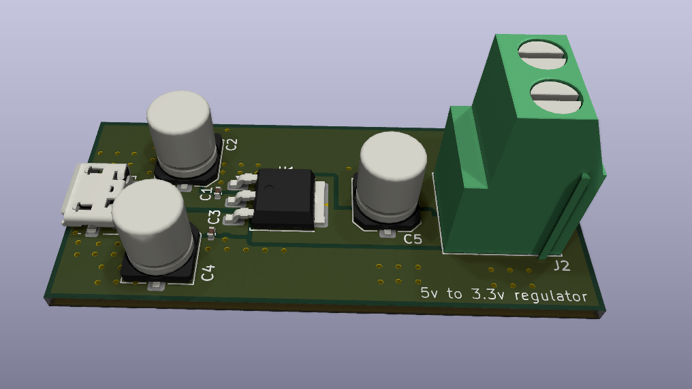
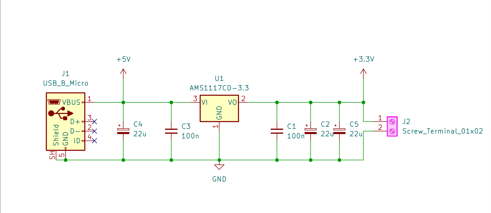

# 5V to 3.3V Linear Voltage Regulator PCB

A compact, custom-designed printed circuit board (PCB) developed in KiCad to regulate a 5V input down to a stable 3.3V output. This board is engineered specifically to provide clean power to microcontrollers, sensors, and low-voltage embedded systems.

## 🚀 Overview

The core of this design utilizes the *AMS1117-3.3* low-dropout (LDO) linear regulator. The project served as an immersive hands-on exercise in hardware design, focusing on tight form-factor optimization, power distribution routing, and custom footprint creation.

### Key Specifications
* *Regulator IC:* AMS1117-3.3 (SOT-223 package)
* *Input Voltage:* 5V DC
* *Output Voltage:* 3.3V DC
* *Form Factor:* Optimized for minimal PCB surface area

---

## 📸 Design Preview

| 3D Render (Top View) | Schematic Preview |
|---|---|
|  |  |

---

## 🛠️ Design & Engineering Challenges Overcome

* *Form Factor Optimization:* Focused heavily on keeping the layout as compact as possible, minimizing trace lengths while ensuring stable performance.
* *Power Distribution Network (PDN):* Structured a directional layout—isolating the 5V input path on one side and routing the 3.3V output rails on the opposite side to minimize cross-talk and maximize power efficiency.
* *Custom Footprints:* Designed custom component footprints to move away from generic libraries, allowing tailored component spacing and layout flexibility.
* *Trace Navigation:* Solved routing puzzles in highly constrained spaces while maintaining proper clearance for power traces and grounding.

---

## 📁 Repository Structure

├── Hardware/          # KiCad project files (.kicad_prl, .kicad_sch, .kicad_pcb)  
├── Production/        # Gerber files (zip) and Bill of Materials (BOM) for fabrication  
├── images/            # 3D renders, schematic and footprint screenshots for documentation  
└── README.md          # Project documentation  

## 📈 Future Steps
* Order physical prototypes for manufacturing.
* Component sourcing and manual SMD soldering.
* Multimeter and oscilloscope testing to verify voltage stability and ripple management under load.
